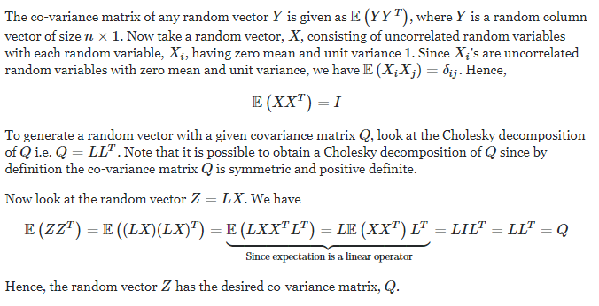

```{r setup, include=FALSE}
knitr::opts_chunk$set(echo = TRUE, warning = FALSE, message = FALSE)
```


## Packages

Most of the functions that we are using here are actually part of base R.

We will need some functions from the {dplyr} and {ggplot2} packages for quick visualizations, but these are optional.

```{r}
library(dplyr)
library(ggplot2)
```

## Simulating dependent variables

Storytelling with data is an important skill for anyone who is analyzing data. You try to find interesting information in data and then think of how to convey these insights to others.

In the previous post we saw how to simulate independent variables. Instead of finding stories in the data we now want to "hide" stories for others to find or to show how a certain analytics / visualization / data wrangling technique works.

An example: when we look at bank clients, we would expect older clients to have (on average!) a higher balance than younger clients.

In this section we are going to have a look at techniques to create dependence between variables.

### Rule based

We can use `ifelse()` and `case_when()` from the {dplyr} package to create new variables that depend on others. Let's make a small example with two columns: married, which indicates if the person is married, and age.

We will simulate 1000 clients, around 50% of which are married.

```{r}
k <- 1000
married <- sample(c("Y","N"),k,replace=T)
```

Next, we want that our married clients are slightly older than our non-married clients. For this example we assume that the average age of the married clients is 40, and the average age of the non-married clients is 30.

```{r}
data <- data.frame(id=1:k,married) %>% 
  mutate(
    age=ifelse(married=="Y", rnorm(k, 40, sd = 10), rnorm(k, 30, sd= 12)) %>% 
      pmax(18) %>% #every client should be at least 18
      round()
    )
```

```{r,echo=FALSE}
head(data)
```

We can take a quick look if the difference is visible in a boxplot.

```{r,echo=FALSE}
  ggplot(data, aes(x=married, y=age))+geom_boxplot()
```

If you have more than two options, `case_when()` can help. We want to see the balance of clients which are either managers, analysts or senior analysts.

```{r}
k <- 1000

ocupation <- sample(c("analyst","manager","sr analyst"),k,replace=T,prob=c(10,2,3))

data <- data.frame(id=1:k,ocupation)

data <- data %>% mutate(balance=case_when(
  ocupation=="analyst" ~ 100+rexp(k,0.01),
  ocupation=="sr analyst" ~ 200+rexp(k,0.005),
  TRUE ~ 200+rexp(k,0.001) #this is the else case
))

#Check the average balance per group
data %>% 
  ggplot(aes(x=ocupation,y=balance))+geom_violin()
```


### Correlation based

If we just deal with numeric variables and want to have a slightly more complex connection between the variables, we can try another approach, for which we specify a correlation matrix beforehand and reorder our variables afterwards so that they match the desired correlation.

Of course, we need to find reasonable correlation values, for example between age and number of kids (probably slightly positively correlated) or between savings and number of kids (probably slightly negatively correlated). This requires some research.

First, we simulate the data independently. Ideas about how to do this can be found in the previous blogpost.

```{r}
set.seed(64)

k <- 2000

age <- rnorm(k,mean=35,sd=10) %>% pmax(18) %>% round()
balance <- rexp(k,rate=0.001) %>% round(2)
tenure <- rnorm(k,mean=15,sd=5) %>% pmax(1) %>% round()
kids_cnt <- sample(0:5,k,replace=T,prob=c(100,120,80,30,5,1))


data <- data.frame(age,balance,kids_cnt,tenure)

```

```{r, echo=FALSE}
data %>% head(7)
```


We directly see that there are things that don't make too much sense, like the 22-years-old with a tenure of 22 years. Further, there is no dependence between the variables.

To improve this, we want to reshuffle the rows and get a correlation close to a desired one. First we simulate a helping dataset of same size, where every entry is random normally distributed.

```{r}
#same size
nvars <- ncol(data)
numobs <- nrow(data)

set.seed(3)
rnorm_helper <- matrix(rnorm(nvars*numobs),nrow=numobs)
```

The correlation of this matrix should be close to the identity matrix.

```{r}
cor(rnorm_helper)
```

Next, we specify our desired correlation matrix. Just to put this in words, we want to correlate the four variables age, balance, kids_cnt and tenure. Each variable with itself has a correlation of 1. We want age and balance to have a positive correlation of 0.3, age and kids_cnt of 0.4 and age and tenure of 0.2. Likewise, we specify all desired correlations between pairs of variables.

```{r}
Q <- matrix(c(1,0.3,0.4,0.2,  0.3,1,0,0.3,  0.4,0,1,-0.3,  0.2,0.3,-0.3,1),ncol=nvars)

Q
```

We can now multiply the `rnorm_helper` matrix with the Cholesky decomposition of our desired correlation matrix `Q`. Why this works, is explained in the following comment. If you are not interested in mathematical details, you can skip this part.



(Explanation found [here](https://math.stackexchange.com/q/163472))

```{r}
L <- chol(Q)
Z <- L %*% t(rnorm_helper)
```

Good, now we convert this new data to a data frame and name it like our original data. 

```{r}
raw <- as.data.frame(t(Z),row.names=NULL,optional=FALSE)
names(raw) <- names(data)

head(raw,7,addrownums=FALSE)
```

The correlation of this dataset is close to our desired outcome.

```{r}
cor(raw)
```

However, this dataset `raw` does not have anything to do with our original data. It is still only transformed random normal data. But as we know that this dataset has the correct correlation, we can use this to reorder the rows of our other dataset.

And then we just replace the largest value of the random normal dataset with the largest value in our dataset, the second largest with the second largest etc. We go column by column and repeat this procedure.

```{r}
for(name in names(raw)) {
  raw <- raw[order(raw[,name]),]
  data <- data[order(data[,name]),]
  raw[,name] <- data[,name]
}

```

Let's check the correlation of this new dataset. It is close to our desired correlation matrix `Q`. The main reason for the small difference is that our variables take less values than a random normal distributed variable (e.g. kids count just takes values between 0 and 5).

```{r}
cor(raw)
```

<aside>
To compare: This was `Q`:
```{r,echo=FALSE}
Q
```

</aside>
Our final reshuffled and correctly correlated dataset is now stored in `raw`.

```{r}
head(raw,7,addrownums=FALSE)
```

## Closing comments

* If you like the correlation method please take a look at the GenOrd package which is a little more professional, when working with ordinal categorical variables.
* The Cholesky decomposition is only possible for positive definite matrices. If this is not the case and you accept a slightly stronger deviation from your desired correlation matrix, the easiest way is to add 0.1, 0.2 etc. to the diagonals until you obtain a positive definite matrix. Note that this lowers the correlation between all variables.

```{r}
diag(nvars) * 0.1 + Q
```

* After the correlation process it might be helpful to check some of your data manually to see if the observation make sense and - if needed - perform manual corrections.