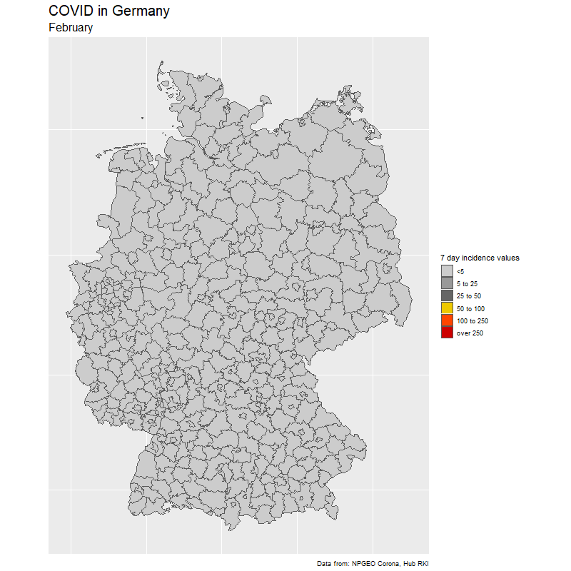

```{r setup, include=FALSE}
knitr::opts_chunk$set(echo = TRUE)


library(sf) # For shapefiles
library(readxl) # Read Excel file
library(ggplot2) # Visualization
library(dplyr) # Data manipulation
library(stringr) # String manipulation
library(stringdist) # String distances

theme_set(theme_void())
```

### The result

```{r, echo=FALSE, out.width = "70%"}

```


### The data

I found a dataset about COVID cases in the different communes (LK) in Germany in an Excel file online ([Link](https://www.rki.de/DE/Content/InfAZ/N/Neuartiges_Coronavirus/Daten/Fallzahlen_Kum_Tab.html;jsessionid=4CB77CB72D7C8E3D5DC7CAF9C1AF8729.internet062)). It shows cases (Fälle) and the 7-Day-Incidence value (per 100,000 inhabitants).

(Note: unfortunately, the RKI changed the format of the data shortly after I downloaded the file, now the same data is only available on a broader Bundesland level. You might want to try [this](https://npgeo-corona-npgeo-de.hub.arcgis.com/datasets/dd4580c810204019a7b8eb3e0b329dd6_0?selectedAttribute=Refdatum) Link).

```{r, echo=FALSE}
cases <- read_xlsx("C:/Richard/R and Python/Datasets/Fallzahlen_Kreise_04_11_2020.xlsx",sheet=5,skip=4)

knitr::kable(head(cases))
```

The SK (Stadt) and LK (Landkreis) are important, as they indicate whether it is about the city or the county around the city. In some cases you have both.

```{r, echo= FALSE}
cases %>% filter(str_detect(LK,"Aschaff|Würzb")) %>% knitr::kable()
```

Now, if I want to show this information on a map, I need a shapefile with the communes. The good news is, there is one ([Link](https://opendata-esri-de.opendata.arcgis.com/datasets/affd8ace4c204981b5d32070f9547eb9_0)). The bad news is, the names are in a different format than in the Excel file with the COVID cases.

```{r, echo=FALSE}
kreise <- read_sf("C:/Richard/R and Python/Datasets/Kreisgrenzen_2017_mit_Einwohnerzahl/Kreisgrenzen_2017_mit_Einwohnerzahl.shp")

kreise %>% st_drop_geometry() %>% select(GEN,BEZ) %>% head() %>% knitr::kable()
```

A first fix to bring the two formats closer together would be to convert BEZ into LK and SK and paste it together with GEN.

```{r, echo=FALSE}
kreise <- kreise %>%
mutate(name=paste(ifelse(BEZ %in% c("Kreisfreie Stadt","Stadtkreis"),"SK","LK"),GEN))

kreise %>% st_drop_geometry() %>% select(name) %>% head() %>% knitr::kable()
```

### A map with missing values

This already helps a lot. Let's see if we can join the COVID indicence values to the shapefile with the communes.

```{r,echo=FALSE}
cases %>% inner_join(kreise,by=c("LK"="name")) %>%
  ggplot() + geom_sf(aes(fill=Inzidenz,geometry=geometry))
```

This already looks quite good, but there are a lot of missing communes.

Let's look into the Excel file with COVID cases which ones did not have a match.

```{r,echo=FALSE}
cases %>% anti_join(kreise,by=c("LK"="name")) %>% head() %>% knitr::kable()
```

Can we find equivalent names in the shapefile? We search for Berlin, Offenbach, Mülheim and Lindau.

```{r,echo=FALSE}
kreise %>% st_drop_geometry() %>%
  filter(str_detect(name,"Berlin|Offenbach|Mülheim|Lindau")) %>% 
  select(name) %>%
  knitr::kable()
```

We notice a few things: Berlin has only one entry in the shapefile and a more detailed breakdown in the COVID cases document. SK Offenbach is called Offenbach am Main, Lindau is called Lindau (Bodensee). And Mülheim a.d.Ruhr is written Mülheim an der Ruhr.

One option would be to find all the matches manually and replace them. There are around 40, so this would be feasible but a little annoying. Maybe we can save this time of comparing each element and let the computer find the best match for us.

Fuzzy matching is doing exactly this: Based on string distances, it finds the closest match in the other source.

### Fuzzy matching

I wrote a function to do the calculation of the string distances and find the best fit. Additionally, we have the option to clean the input before, i.e. transform all letters to lowercase, remove or replace certain words which disturb the process. Usually such words would become clear after running the matching process once and noticing some undesired results.

```{r,echo=FALSE}

cleaner <- function(vec) {
  vec %>% tolower() %>%
    str_remove("eifelkreis|regionalverband|stadtverband|saale") %>%
    return()
}


  
fuzzy_matches <- function(clean_vec,dirty_vec) {
  control <- data.frame(original=dirty_vec)
  
  distmatrix <- stringdist::stringdistmatrix(cleaner(clean_vec),cleaner(dirty_vec),method='jw',p=0.1)
  best_fit <- apply(distmatrix,2,which.min) %>% as.integer()
  similarity <- apply(distmatrix,2,min)
  
  control$best_fit <- clean_vec[best_fit]
  control$similarity <- similarity 
  
  return(control %>% arrange(desc(similarity)))
}

dict <- fuzzy_matches(kreise$name,cases$LK)

dict %>% filter(similarity>0) %>%
  slice(seq(1,39,2)) %>%
  knitr::kable()

```

This table serves as a control point. We can check that all the items were matched correctly. It also serves as a dictionary which we will use to replace the original names before joining.

```{r,echo=FALSE}
cases %>%
  mutate(LK_new=plyr::mapvalues(LK,from=dict$original,to=dict$best_fit)) %>% 
  left_join(kreise,by=c("LK_new"="name")) %>%
  ggplot(aes(fill=Inzidenz))+geom_sf(aes(geometry=geometry))

```

### Creating a gif

To create the gif, we select dates of interest (in our case day by day from Feb 15 to Nov 25). 

```{r, eval=FALSE}

sel_dates <- seq.Date(from=as.Date("2020-02-15"),to=as.Date("2020-11-25"),by="day")
img_frames <- paste0("covid", seq_along(sel_dates), ".png")

```

We loop through the dates and create one image for each day. Note how easy it is to create the Germany map with `ggplot(aes(fill=cases7_per_bin))+geom_sf()` from the {sf} package. The rest is just changing the colors.

```{r, eval=FALSE}
for (i in seq_along(sel_dates)) {
  
  message(paste(" - image", i, "of", length(sel_dates)))
  
  map <- final %>%
    filter(date %in% sel_dates[i]) %>%
    ggplot(aes(fill=cases7_per_bin))+geom_sf()+
    labs(title = 'COVID in Germany',
         subtitle = format(sel_dates[i],"%B"),
         fill = "7 day incidence values",
         caption = "Data from: NPGEO Corona, Hub RKI") +
    scale_fill_manual(values=c("grey80","grey60",
                               "grey40","gold2","orangered1","red3","red4"),drop=FALSE)


  png(filename=paste0("covid",i,".png"),width = 800,height = 800)
  print(map)
  dev.off()
}
```

After saving all the images, we can use {magick}'s `image_write_gif` function to put them together and create our gif.

```{r, eval=FALSE}
magick::image_write_gif(magick::image_read(img_frames),
                        path = "covid.gif",
                        delay = 1/10)
```


### Closing comments

* I recently started putting the fuzzy matching functionality into a package. Check out the first version of {fuzzymatch} [here](https://github.com/richardvogg/fuzzymatch). The function `fuzzy_matches` performs the task of matching names from one datasource to another.
* The code behind this example was written with R and can be found [here](https://github.com/richardvogg/30DayMapChallenge) (under Day 25 - COVID)
* I previously used fuzzy matching in an example from the banking world (matching company names) and talked about this in Latin-R 2019, you can find the presentation and the deck [here](https://github.com/richardvogg/LatinR-2019-Fuzzy-merging).
* If you wonder about what happened to the Berlin case in our example above, I did not take extra care of it. In practice one would have to sum up the cases and find an average incidence value to replace the values from different parts of the city. As this was not directly related to the fuzzy matching exercise, I omitted it.
* I am very curious if there are other applications for fuzzy matching in the GIS world, or if there are other methods to overcome a problem like this. Feel free to reach out to me.