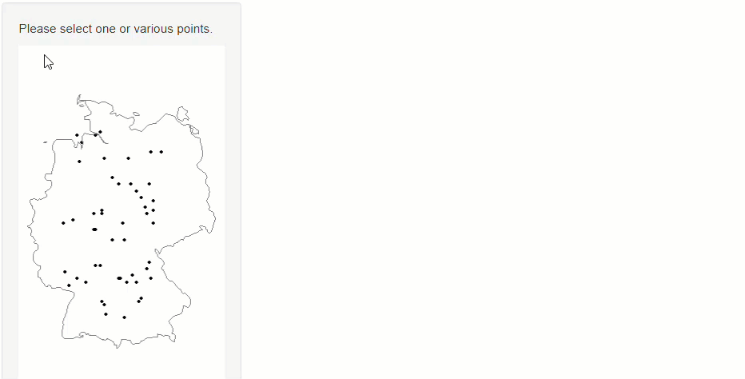

```{r setup, include=FALSE}
knitr::opts_chunk$set(echo = TRUE, warning=FALSE, message=FALSE)

library(dplyr)
library(shiny)
library(ggplot2)
library(wakefield)
```

## The result

This is what we want to achieve. The user can select one or more points on the map to see additional information for the position.

```{r, echo=FALSE, out.width = "100%"}

```

## Packages

To run the example successfully, I needed the following packages.

```{r, eval=FALSE}
library(shiny)
library(dplyr)
library(ggplot2)
```


## The data

We will work with some example data, consisting in random points and for each of the points some temporal information.

```{r, echo=F}

df <- r_data_frame(
  n=50,
  lon = runif(), 
  lat = runif(), 
  r_series(age,j=12,integer=TRUE, relate = "+5_10", name="month")
) %>%
  mutate(lon=round(7.5+(12.5-7.5)*lon,1),
         lat = round(48+(54-48)*lat,1))


knitr::kable(df[1:5,1:9])
```

We first convert the data to be in tidy format (using `pivot_longer` from the {tidyr} package), i.e. we will have one column called month and one column containing the values.

```{r, echo=FALSE}
df <- df %>%
  tidyr::pivot_longer(cols=starts_with("month"), names_to = "month",values_to="value") %>%
  mutate(month=readr::parse_number(month))

knitr::kable(head(df, 8))
```


## Quick exploration

Let's see what we can do with this data. First, we can use `borders` to show a quick map.

```{r}
map <- ggplot(df)+
  geom_point(aes(x=lon,y=lat))+
  borders(regions="Germany")+
  coord_quickmap()+
  theme_void()

map
```

As we want to be able to select points interactively, we want to display which points were selected. This is what the map would look like.

```{r}
exmpl <- df %>% slice(1) %>% select(lon,lat)

map + 
  geom_point(data=exmpl,aes(x=lon,y=lat),size=3,col="red")
```


Last, we want to show the temporal development for the selected points. This can be an easy line chart, for the filtered point.

```{r}
df %>%
  filter(lon == exmpl$lon,lat == exmpl$lat) %>%
  mutate(month=factor(month.abb[month],levels=month.abb)) %>%
    ggplot(aes(x=month,group=1))+
    geom_line(aes(y=value),size=2)
```

## Functions

To make the Shiny app short and concise, I will put the functionalities which create the three plots into functions.

* `plot_map(df)`: Creates the map with the points.
* `plot_selected_point_in_map(df,lon,lat)`: Creates the same map but highlighting the points in `lon` and `lat`.
* `show_detail(df,lon,lat)`: Creates the line plot for selected points.

## Shiny App

First, we will define the user interface. In this case we have a sidebar panel which contains the map and a main panel where the line plot will appear when points are selected.

The important lines to notice are that in `plotOutput` for the map, we will add the parameters `click` and `brush`. Doing this, we can later define what happens when someone clicks on the points.

```{r, eval=FALSE}
ui <- fluidPage(

    sidebarLayout(
        sidebarPanel(
          p("Please select one or various points."),
            plotOutput("example_map", 
                       click = "plot1_click",
                       brush = "plot1_brush"
            )
        ),

        mainPanel(
            plotOutput("time_plot")
        )
    )
)
```

Inside the server function, we have several steps, which I will explain one by one. First, we need some variables that will be updated when the user selects points. `lat`, `lon` and `time` are empty in the beginning. For map, we will plot the initial map which shows all points.

```{r, eval = FALSE}
vals <- reactiveValues(lat=NULL,
                       lon=NULL,
                       map=plot_map(df), 
                       time = NULL) 
```

For the two plot outputs it is easy, we will just return the respective variable of the reactive value, i.e. the map and the line chart.

```{r, eval = FALSE}
output$example_map <- renderPlot({
  return(vals$map)
})
    
output$time_plot <- renderPlot({
  return(vals$time)
})
```

The key for the triggered action is the process of selecting a point. Remember that in the `ui` part we specified another parameter for the map: `click = "plot1_click"`. Here we will specify what happens when someone clicks on the map.

First, we will check if there is a close point to the click in the dataset `df`. If this is not the case, nothing happens. Otherwise, we will assign the coordinates of the selected point to `vals$lat` and `vals$lon` our reactive variables. Additional we will change the map from the standard map to the map with selected red points and will show the line plot for the selected points. As these are reactive values, our plots will be updated automatically.

```{r, eval = FALSE}
observeEvent(input$plot1_click, {
    point <- nearPoints(df %>% distinct(lon,lat), input$plot1_click, addDist = FALSE)
    if(length(point[[1]])==0) {} #happens when no point is selected
    else {
        vals$lon <- point[[1]]
        vals$lat <- point[[2]]
        vals$map <- plot_selected_point_in_map(df,vals$lon,vals$lat)
        vals$time <-  show_detail(df,vals$lon,vals$lat)
    }
})
```

You will see that the brush option is very similar. Note, that there are two other options, `hover` and `dblclick` which can trigger actions when you just hover over a points or double click. This would be the complete `server` function when putting the steps together.

```{r, eval=FALSE}

server <- function(input, output) {
    
    vals <- reactiveValues(lat=NULL,
                           lon=NULL,
                           map=plot_map(df),
                           time = NULL)
    
    output$example_map <- renderPlot({
        return(vals$map)
    })
    
    output$time_plot <- renderPlot({
      return(vals$time)
        
    })
    
    observeEvent(input$plot1_click, {
        point <- nearPoints(df %>% distinct(lon,lat), input$plot1_click, addDist = FALSE)
        if(length(point[[1]])==0) {} #happens when no point is selected
        else {
            vals$lon <- point[[1]]
            vals$lat <- point[[2]]
            vals$map <- plot_selected_point_in_map(df,vals$lon,vals$lat)
            vals$time <- show_detail(df,vals$lon,vals$lat)
        }
        
    })
    
    observeEvent(input$plot1_brush, {
        point <- brushedPoints(df %>% distinct(lon,lat), input$plot1_brush)
        if(length(point[[1]])==0) {} #happens when no point is selected
        else {
            vals$lon <- point[[1]]
            vals$lat <- point[[2]]
            vals$map <- plot_selected_point_in_map(df,vals$lon,vals$lat)
            vals$time <- show_detail(df,vals$lon,vals$lat)
        }
    })
}
```

## Closing comments

* I used this functionality in a basic app which is exploring changes in temperature, precipitation and soil moisture in Chile in the last 10 years (compared to the 30 years average). The first draft can be found [here](https://rvdatainsights.shinyapps.io/ChileClimate/).
* Of course, this interactivity is not limited to maps, you can use this to make any type of plot more interactive and create very insightful Shiny apps.
* In case you are interested in the data creation process for this example. I used the wakefield package which creates series of columns.

```{r}
library(wakefield)

df <- r_data_frame(
  n=50,
  lon = runif(), 
  lat = runif(), 
  r_series(age,j=12,integer=TRUE, relate = "+5_10", name="month")
) %>%
  mutate(lon=round(7.5+(12.5-7.5)*lon,1),
         lat = round(48+(54-48)*lat,1))

```

Later I transformed the data to long format.

```{r}
df <- df %>%
  tidyr::pivot_longer(cols=starts_with("month"), names_to = "month",values_to="value") %>%
  mutate(month=readr::parse_number(month))
```
