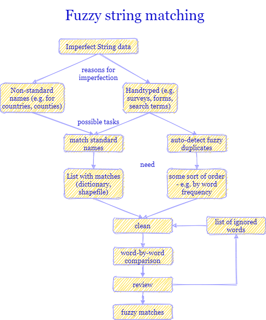
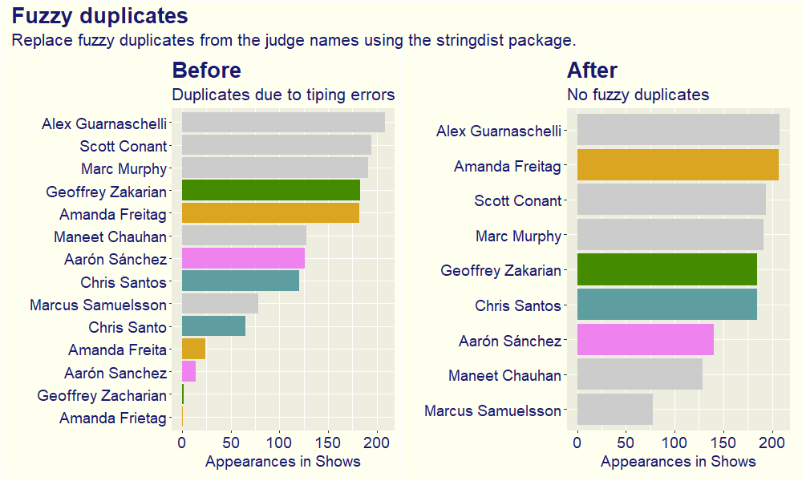

```{r setup, include=FALSE}
knitr::opts_chunk$set(echo = FALSE)
```

## Structuring thoughts

I started drawing a map with [draw.io](https://app.diagrams.net/) to show the structure of the ideas I want to write about. I want to keep this post on a conceptual level with examples. I plan to write about useful packages and how to use R to work with fuzzy string matching in future posts.

```{r,out.width="70%", fig.align='center'}

```

This map will serve as an outline for the post.

## When to use fuzzy string matching

Data Analysts and Data Scientists know how to work with different types of variables. Knowing if a variable is numeric, a (categorical) factor or a boolean is important for preprocessing, visualization and modeling. Fuzzy string matching is helpful when working with text input, specifically imperfect text input.

In general, I would distiguish two different types of imperfection in the text variable.

- The data was typed in manually by a human (or many humans)
  * responses from forms or surveys
  * data that was typed by hand into an Excel/text file
- The data comes from different sources or has several possible alternative names 
  * country names: United States vs United States of America
  * addresses: Main Street 123 vs 123 Main Street
  * product descriptions: iPhone vs Apple iPhone
  
The problem with imperfection in text data is that analysis is not easily possible:

- If we are dealing with handtyped company names, we do not even receive a reliable answer when asking: "How many records do we have from company xyz?" (check this [blogpost](https://r-vogg-blog.netlify.app/posts/2020-10-09-fuzzy-merging/))
- We will see unfair rankings, because some records are not counted, like in this TidyTuesday example.

```{r,fig.align='center'}

```

- We will have problems joining to other data sources, as described in this [blogpost](https://r-vogg-blog.netlify.app/posts/2021-01-31-tracking-covid-in-germany/).
  
## Imperfect strings - how to find the "perfect" version

When we have a list of imperfect strings, there are two possibilities how to match them to their "perfect" counterparts.

- Either we have a list of correct names. This could be a dictionary, a list of official company names (like the S&P 500), or a file which contains further information for every country.
- Or we want the data to find the correct names by itself. In this case we would need some criterion which names are more likely to be "correct" (e.g. word frequency). This is often called fuzzy deduplication.

## Cleaning

Many differences can already be removed by cleaning the data. This could be:

- converting all strings to lower case letters.
- removing leading and trailing white spaces - or maybe even removing all whitespaces.
- removing punctuation and control characters (%,&,$,-)
- removing some words (more about this in the section "The ignore list")
- turning extended characters to their basic form (e.g. ö to o, ñ to n).
- using string fingerprints (described for example [here](https://github.com/OpenRefine/OpenRefine/wiki/Clustering-In-Depth)).


## The string comparison - the core of fuzzy string matching

After all the initial steps, it comes down to the core of the matching algorithm. We take two words (either one from the imperfect list and one from the perfect list, or we compare words from the imperfect list in a pairwise manner) and compare them.

We want to put a numerical value to the similarity of two strings (or alternatively to the distance, which is the opposite).

Intuitively, we "know" or "feel" that the strings baseball and basketball are rather similar and that breakfast and hello are not very similar.

What is the reasoning behind this feeling?

- How many letters do the words share?
- Are the letters they share in a similar position in the string?
- Are the strings approximately of the same length?
- Are parts of the words the same but in different order? (homework vs work-from-home)

There are many algorithms which are used to measure similarity between strings. As always, too many choices can be intimidating, so I will name only two methods which I find useful for many applications.

- Jaro-Winkler: takes into account the length of the strings, the number of shared letters, the number of transpositions of shared letters (e.g. example and exampel would be 1 transposition), and the number of matching letters among the first four letters. Jaro-Winkler is strong in cases when the imperfections happen mainly at the end of the string, for example through additional words (Company ABC International vs Company ABC Int).

- Levenshtein distance: also known as Edit distance. This is the most famous and most used string distance. It counts, how many insertions, deletions and replacements of letters are needed to get from one string to the other. 

If you are interested in more details or more string distance measures, I recommend this  [blogpost](https://www.joyofdata.de/blog/comparison-of-string-distance-algorithms/).

Which string distance measure works best depends highly on the type of imperfection in the data. It would even be possible to calculate two distance measures and use them in combination to find a suitable threshold.

## Check results - false positives and false negatives

After making a lot of string-by-string comparisons, the fuzzy string matching process is almost over. For each imperfect string we will have a closest match or several closest matches and can review the process.

To review the results I usually create a small data frame, containing the original string, the best fit, and the distance between both. In this data frame, I order the results by the distance.

```{r,fig.align='center',out.width="70%"}
knitr::include_graphics("img/list.jpg")
```

By scrolling through the complete ordered list, we will see many cases with small distance, i.e. almost perfect matches. In some applications, we will see that there are matches which should not be matches (false positives) - i.e. McDonnell and McDonald's. Those strings are very similar but should not be matches.

One chance to avoid false positives is to set a threshold, i.e. we would only consider a best-fit to be a match if it is similar enough. And this similarity threshold could be determined by eye ("at which level of similarity does the first false positive occur?").

Doing this, we will create a second problem: false negatives. By setting a very low threshold, we would potentially miss a lot of actual matches.

This is a though challenge. We have to find a good compromise, between not being too strict and losing a lot of opportunities for matches and being too relaxed and replacing many strings by matches which are actually wrong. The decision depends a lot on the cost of false positives and false negatives.

## The ignore list

In many applications you will not find a satisfying threshold from the beginning. You will see that there are some early false positives, but also many actual matches with lower similarity. 

One possibility to improve the result is to ignore some words which do not actually help to identify matches, and rather disturb the process of string similarity calculation.

There is no golden rule about which words to ignore, but some guidelines:

- Ignore words that are applicable for almost all strings in the domain. If you are dealing with company names ignore "Company", "Corporation", "International", "Ltd".
- Ignore abbreviations of these words as well: "Comp", "Corp", "Int".
- If you work with a list of "perfect" strings, you have to ignore the words in both lists. I usually include the words to ignore in the cleaning process.
- Creating the ignore list is often an iterative process. You run the matching process, and review the result. Then you notice how you can prevent many false negatives from happening because they contain certain types of words. You add those words to the ignore list and start again with the matching process.

## One column matching vs several column matching

So far, we have been looking at matching one variable. There are many applications where it is necessary to compare several columns.

Record Linkage is a subtype of fuzzy string matching where you want to check the identity of a person by information coming from different systems. Banks have to make sure that their customers are who they claim to be, and invest a lot of money and efforts into KYC (Know your customer) systems.

However, just checking the name will give tons of false positives (there are so many people who share the same name - i.e. that would be perfect matches). When you compare name, address and phone number, you can expect better results. Additional to the points we mentioned about cleaning and fuzzy matching, you would also have to put weights to different situations - what if name and address coincide and the phone number is missing in one source? What if the name is slightly similar and the address is the same?

As before, there is some manual checking necessary to create a good fuzzy string matching system.


## Questions to ask before starting

- Do I really need fuzzy matching? If your dataset only contains 10 values, it is much faster to manually find the matches. As with all automation tasks, you have to compare the time investment for developing the automation with the time savings.
- What is the source of imperfection in the strings? This influences:
  - How much cleaning is necessary before starting?
  - Which stringdist algorithm is the best to find the correct matches?
- What is the "cost" of false positives and false negatives? This influences:
  - How much time do I have to invest in creating the ignore list.
- Do I want to match one column or several columns?
- Do I have a list of "correct" strings or do I want the data to find its "correct" candidates itself?