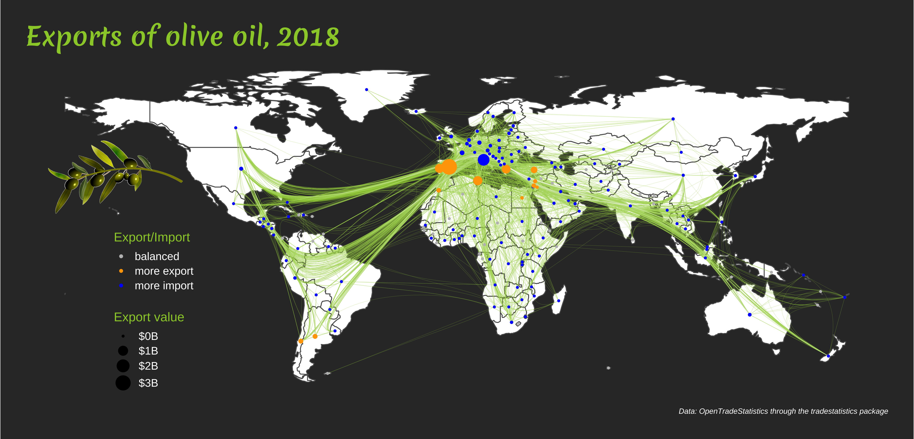
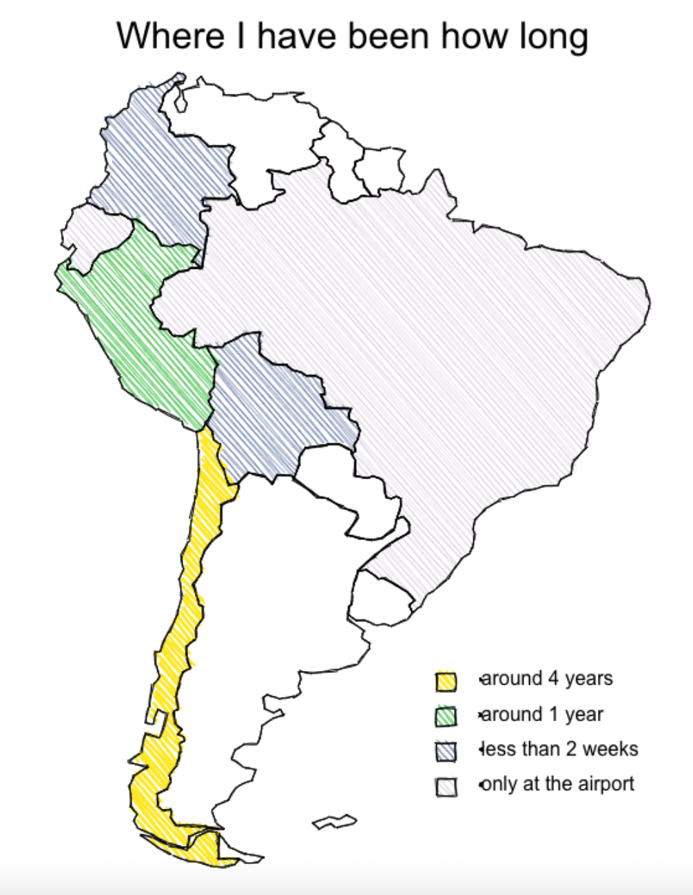
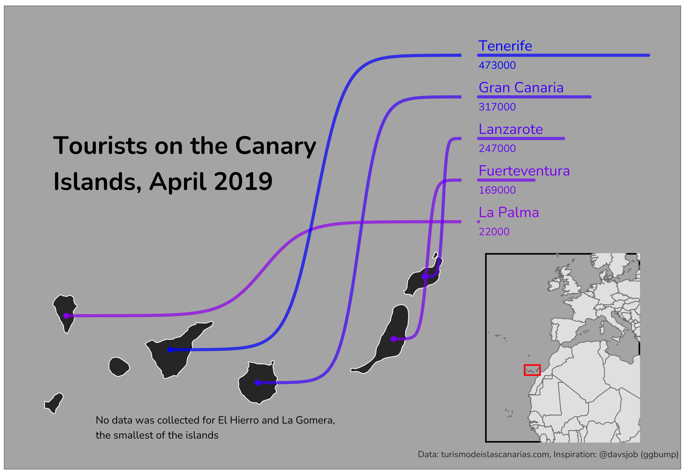
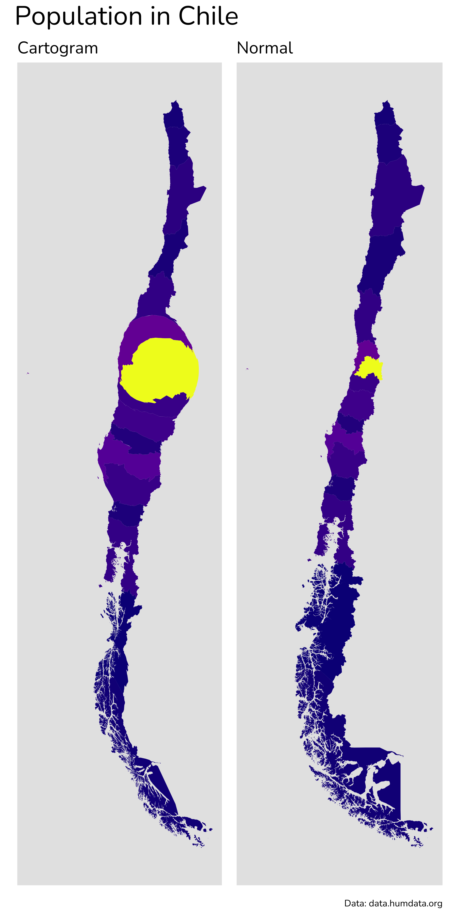
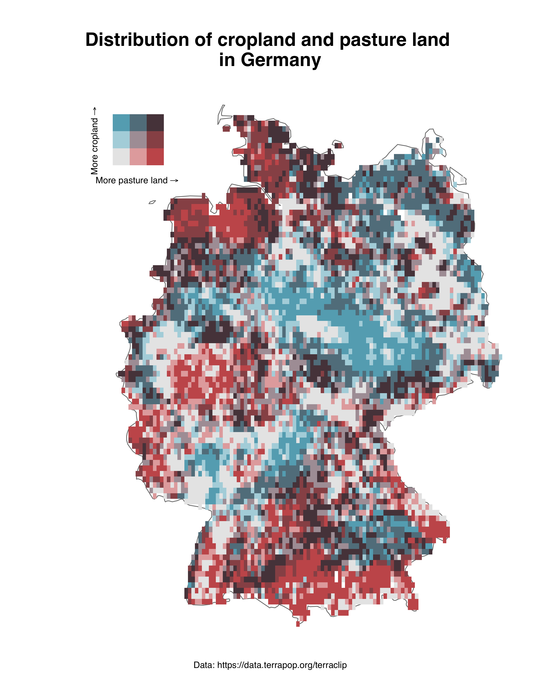
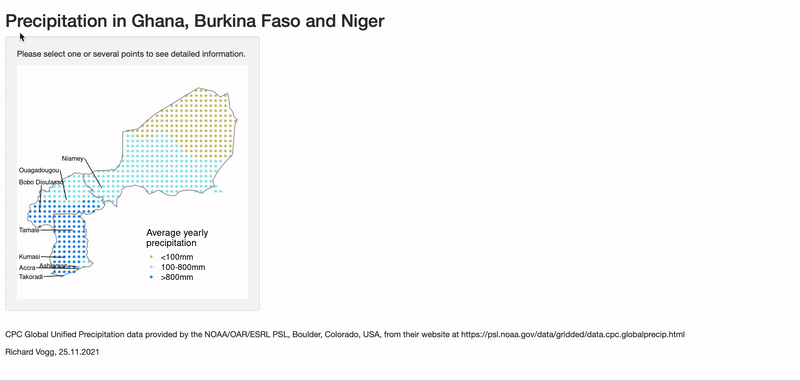

```{r setup, include=FALSE}
knitr::opts_chunk$set(echo = FALSE)
```

If you don't feel like reading and just want to see some maps take a look at my [GitHub repository](https://github.com/richardvogg/30DayMapChallenge21). 

## Background and my motivation

The [#30DayMapChallenge](https://r-vogg-blog.netlify.app/posts/2021-01-28-30daymapchallenge/) is a challenge created by [Topi Tjukanov](https://twitter.com/tjukanov). Every day for the month of November participants create maps for a given topic (e.g. Points, Green, Population, Elevation) and share their results mainly on Twitter (look for #30DayMapChallenge for a few hours full of beautiful maps).

I started learning about maps last year and had a lot of spare time in November 2020 so I participated in the 30DayMapChallenge for the first time. I learned how to create maps with R and was very happy about this. Now, one year later, I did not have so much time, but still wanted to make at least a few maps to not lose practice. Also, I have seen very cool packages being used and shared via Twitter during the last year and wanted to try them out.

This year, due to the limited time I did not focus too much on discovering new data sources, but if you want to see what I found last year, check out this [article](https://r-vogg-blog.netlify.app/posts/2021-01-28-30daymapchallenge/).

I created nearly all my maps with R (except for the South Americake on day 15). All my codes are also shared on my [GitHub](https://github.com/richardvogg/30DayMapChallenge21). 

## Packages

I explored many new packages and wanted to quickly share my excitement for them in this post. Thank you to the authors of the packages for created those and sharing tutorials on how to use them.

### edgebundle

During the last year I have quite a few awesome applications of this [package](https://github.com/schochastics/edgebundle) by [David Schoch](https://twitter.com/schochastics). So I wanted to try it out with import and export data (available in the tradestatistics package). I played around with the different edgebundling algorithms to see general flows of olive oil (and other goods).



### roughsf

During the challenge David announced that he wrote [roughsf](https://github.com/schochastics/roughsf), a package for creating maps which look like sketches. Of course, I wanted to give it a try and many others did so as well.

```{r, out.width = "70%", echo=FALSE}

```


### ggbump

[David Sjöberg's](https://twitter.com/davsjob) package [ggbump](https://github.com/davidsjoberg/ggbump) can be used for many visuals and I was always intrigued to look into an example where a map is linked to a sorted bar chart. I tried to replicate it with the Canary Islands. I felt that it is best to use for around 8 - 12 shapes. For so few it was a little unnecessary, and for too many it would be difficult to follow the lines.

```{r, out.width = "90%", echo=FALSE}

```


### viridis

The [viridis](https://cran.r-project.org/web/packages/viridis/vignettes/intro-to-viridis.html) package contains great color palettes. It is easy use within ggplot with `scale_color_viridis_c()` for filling continuous variables and `scale_color_viridis_d()` for coloring discrete variable. But you can also access the hex color names by calling viridis::magma(10) to get ten equidistant colors of the magma color palette. 


### cartogram

The [cartogram](https://github.com/sjewo/cartogram) package reshapes shapes based on other variables like population. Using it for Chile was a fun experience because it shows a little bit how many people live in Santiago compared to the rest of the country (it looks a little bit like a tumor that makes the rest of the country sick).

```{r, out.width = "50%", echo=FALSE}

```


### biscale

The [biscale](https://github.com/slu-openGIS/biscale) package and the idea behind the package were used in many contributions during the challenge. It is great, because it allows to color a map based on two variables and their intersections. I used this to show which areas of Germany are mainly used for cropland and for pasture land (or both, or nothing).

```{r, out.width = "80%", echo=FALSE}

```


### patchwork

The package [patchwork](https://github.com/thomasp85/patchwork) by [Thomas Lin Pedersen](https://twitter.com/thomasp85) is advertised as the composer of ggplots. It is one of my absolute favorite packages overall and I use it a lot. patchwork allows to show two maps side by side or also to inset one map into the other. I used this functionality (`inset_element()`) in many maps.

```{r, out.width = "90%", echo=FALSE}
knitr::include_graphics("img/day4.png")
```

For this map I also used the [geogrid](https://github.com/jbaileyh/geogrid) package, about which I already wrote last year.

### shiny

Shiny is a package which helps with the creation of web applications from R. It is relatively easy to add interactivity to plots and maps to show specific features of selected regions. I played around with the functionality for the day "Interactivity" to show how precipitation has changed in three selected countries in Africa. The data is also available for all the countries - so this can be replicated easily.



If you would like to try out the interactive version of this contribution, it is available [on shinyapps.io](https://rvdatainsights.shinyapps.io/PrecipitationDiffAfrica/).

## Random thoughts

### I also learned about...

**ggsave**: I finally made the switch from saving my maps manually to using ggsave! It had the nice side effect that my plots are saved in higher resolution and makes my whole workflow more reproducible.

**Flexible map titles**: Instead of adding title, subtitle and caption in the pre-defined way for ggplot, I started using annotate to add the title to free spaces within the map.

**Colors and fonts**: Moreover I started focusing more on colors that work well together and looking for non-standard fonts. Both make a huge difference in how the map looks like in the end and I admire people who create visually appealing maps a lot.

### Thoughts for future challenges

**Annotations**: One thing that I would like to focus more on in the future would be to work much more with annotations. ggplot has the annotate function and some of the maps I like most work with annotations to guide the reader to interesting places on the map. 

**Projections**: And I would also like to learn more about projections. So far I have been happy if I bring everything to a standard projection to merge data (even this sometimes took a lot of time and nerves), but I really liked some of the maps using fancier projections.

**More restrictive rules**: For the 30Day*Chart*Challenge in April but also during this challenge I felt sometimes that the options for one topic are so many that I did not really find a good idea to start with. I saw that some participants focused on certain countries or even certain cities for all their maps (as long as possible), others used only one tool or one package. In the past I have seen that people use a fixed templates for the map, or to have one large datasource from which many of the maps can be created. Limiting the possibilities is sometimes a good way for not being overwhelmed. On the other hand, having all these possibilities is what makes this challenge so great, because people come up with really creative ideas.

**Don't start from zero**: Next time I would try a different approach for some days. Instead of starting from zero and going to a somewhat presentable map, I would start from a map that is already created and spend the same amount of time to make this map better / different. I noticed for the days 6, 7 and 8 that this approach led to good progress.

## Other maps I liked (a lot)

I am not sure if it is a good idea to single out a few maps, because there were so many cool and creative contributions by so many people that it would fill a whole book to list everything I liked. But I would like to try it this year, because maybe some of the readers would like to follow some of the map makers which inspired / wowed me most. I only picked one map for everyone but on  their Twitter accounts you will see so many other cool maps. It is worth it, I promise.


- Lorena Abad
https://twitter.com/loreabad6/status/1456709747290292231

```{r}
tweetrmd::tweet_screenshot(tweetrmd::tweet_url("loreabad6", "1456709747290292231"))
```

- David Schoch
https://twitter.com/schochastics/status/1455508236598132737

```{r}
tweetrmd::tweet_screenshot(tweetrmd::tweet_url("schochastics", "1455508236598132737"))
```

- Gaëlle Sutton
https://twitter.com/Gaelle_Sutton/status/1459060392378789888

```{r}
tweetrmd::tweet_screenshot(tweetrmd::tweet_url("Gaelle_Sutton", "1459060392378789888"))
```

- Cédric Scherer
https://twitter.com/CedScherer/status/1456750614289993731

```{r}
tweetrmd::tweet_screenshot(tweetrmd::tweet_url("CedScherer", "1456750614289993731"))
```

- Helen McKenzie
https://twitter.com/helenmakesmaps/status/1460981196008079366

```{r}
tweetrmd::tweet_screenshot(tweetrmd::tweet_url("helenmakesmaps", "1460981196008079366"))
```

- Kate Berg
https://twitter.com/pokateo_/status/1461771050912518163
- Ilya Ilyankou
https://twitter.com/ilyankou/status/1459431881280311301
- @leeolney
https://twitter.com/leeolney3/status/1463334367464407050
- @dakvid
https://twitter.com/dakvid/status/1462340751996514310
- Federica Gaspari
https://twitter.com/fede_gaspari/status/1464632609489760265
- Benjamin Nowak
https://twitter.com/BjnNowak/status/1463032063339253766
- @researchremora
https://twitter.com/researchremora/status/1460076981501014019
- Georgios Karamanis
https://twitter.com/geokaramanis/status/1464326533233975297
- Amit Levinson
https://twitter.com/Amit_Levinson/status/1461090077422063621


## Closing words

It was a great experience to participate once more in the #30DayMapChallenge. I feel happy for everything I learned and all the beautiful maps and ideas I saw from other participants. On the other hand I am also happy that I did not stress myself into making all 30 maps because there were days where time was very limited for me.

A big thank you to Topi Tjukanov for starting this challenge three years ago, and for offering it this year as well. And a round of applause to all the creators of maps and participants - it was a joy following the hashtag on Twitter during the last 30 days.

