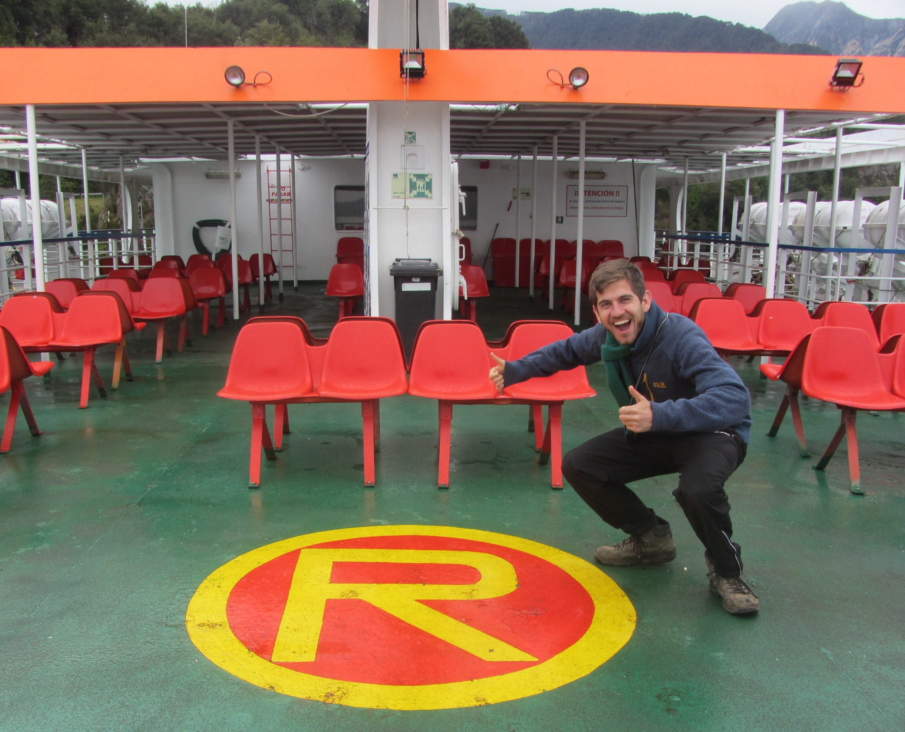

```{r setup, include=FALSE}
knitr::opts_chunk$set(warning=FALSE,message=FALSE)
```


My name is Richard Vogg. I studied mathematics at TU Kaiserslautern in Germany, where I focused on statistics and obtained a Master's degree.

Afterwards I moved to Valparaíso, Chile for three years and worked as a Senior Business Analyst for an international data analytics company. In late 2020 I moved back to Germany, looking for new interesting data projects.

{width=50%}

Using R makes me happy. Sometimes I learn interesting things that might be interesting for others. I created this blog to share them.

### Contact and Codes

[`r icon::fa("envelope")` richard.vogg@web.de](https://twitter.com/richard_vogg)    
[`r icon::fa("github")` richardvogg](https://github.com/richardvogg)    
[`r icon::fa("twitter")` richard_vogg](https://twitter.com/richard_vogg)

### Why I created this blog

I am using R almost every day for the analysis of data.

After reading [this](https://medium.com/@racheltho/why-you-yes-you-should-blog-7d2544ac1045) great blogpost by Rachel Thomas, called "Why you (yes, you) should blog" I started playing around with the idea of writing down some of the things I learn.

Especially this point resonated a lot in me:

> You are best positioned to help people one step behind you. The material is still fresh in your mind. Many experts have forgotten what it was like to be a beginner (or an intermediate) and have forgotten why the topic is hard to understand when you first hear it. The context of your particular background, your particular style, and your knowledge level will give a different twist to what you’re writing about.
> `r tufte::quote_footer('--- Rachel Thomas')`

I would like to add to this point that you are a much stronger influence to people close to you (e.g. colleagues). They will feel encouraged to ask questions because they know you. With this point I want to explicitely encourage everyone who has questions while reading this blog to reach out to me, even if you don't know me. 

The next event that brought me closer to this blog was a tutorial by Maëlle Salmon during Latin-R 2020. The material can be found [here](https://bloguearrr.netlify.app/intro/starters/). She showed how easy it is to get started with {distill} and how to setup a blog. Alison Hill's blogposts and tweets were also very helpful on my journey to start blogging.

The last ingredient I needed were topics to write about. As I will be speaking about Data Composition during rstudio::global(2021), I thought this was a great opportunity to summarize some methods and ideas around this topic.